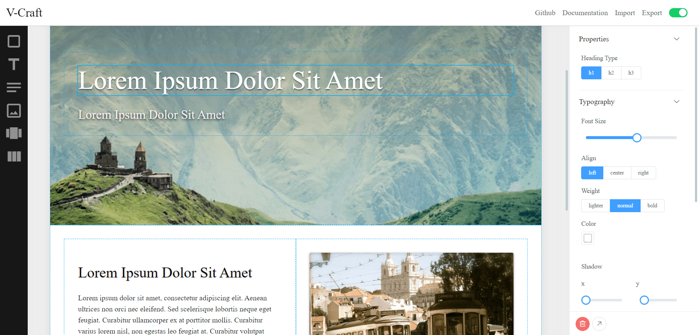

# V-Craft


V-Craft (inspired by [Craft.js](https://craft.js.org/)) is a toolset for building extensible page builders with Vue.js. Instead of a complete page builder with a user interface and designed element blocks out of the box, V-Craft only provides the essentials of the page builder. With V-Craft, you will able to focus on the specifications and use cases of your page builder project, and build your page builder perfectly fit on your needs.

[](https://yoychen.github.io/v-craft/)

## Features

 - Easily wrap your Vue.js components into page elements
 - Build-in drag-n-drop system
 - Control how page elements are edited yourself
 - Manipulatable and serializable editor state

## Documentation

Read the [demo and documentation](https://yoychen.github.io/v-craft/).

## Developing V-Craft 

### Project setup
```
npm install
```

#### Compiles and hot-reloads for development
```
npm run serve
```

#### Compiles and minifies for production
```
npm run build
```

#### Run your unit tests
```
npm run test:unit
```

#### Lints and fixes files
```
npm run lint
```

#### Customize configuration
See [Configuration Reference](https://cli.vuejs.org/config/).
